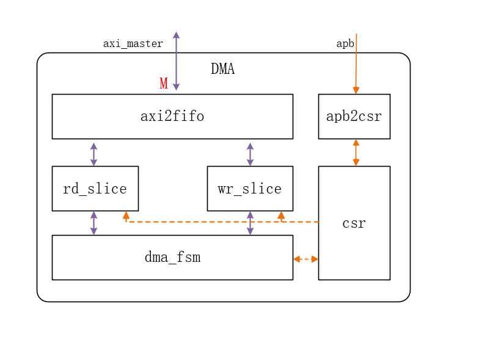

This project is an AXI-based DMA (Direct Memory Access) controller, supporting multi-descriptor, APB register configuration, AXI4 data transfer, burst transfer, error handling, and more. It is suitable for high-speed data movement scenarios in SoC systems.


## Directory Structure

```
bin/         # Utility scripts (register code auto-generation)
doc/         # Design documents, architecture diagrams, register tables, etc.
rtl/
  src/       # Main RTL source code (Verilog)
tb/          # Testbench and simulation cases
verif/       # Simulation scripts, Makefile, etc.
```

## Main Modules

- dma_top.v: Top module, integrates CSR and DMA core, connects APB and AXI interfaces.
- dma_csr.v: Control and status register module, APB interface.
- dma_core.v: DMA core, manages read/write slices, AXI interface, state machine, etc.
- dma_axi2fifo.v: AXI to FIFO data buffering module.
- dma_fifo.v: General-purpose FIFO implementation.
- dma_reg.v: Auto-generated register file.
- gen_reg.py: Python script for automatic register Verilog code generation.

## Features

- APB interface for DMA register configuration
- AXI4 interface for data transfer, 32/64-bit data width
- Multi-descriptor chained transfer support
- Burst and jump transfer modes
- Error detection and interrupt support
- Configurable FIFO buffering

## Simulation & Verification

1. Enter the `verif` directory
2. Compile and run simulation using Makefile:

```sh
make all
```

Or run simulation only:

```sh
make sim
```

- Main testbench: tb/tb_top.v
- AXI RAM model: tb/axi_ram.v

## Documentation

- For architecture diagrams, register tables, etc., please refer to the files in the `doc` directory.

## Dependencies

- A SystemVerilog-compatible simulator (Synopsys VCS)
- Python 3 (for register code generation)
````